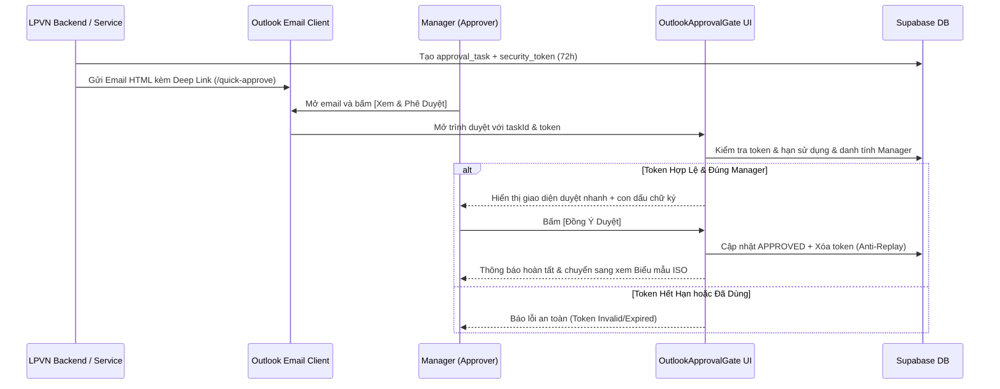

# Phase 11b — Outlook Basic Mode Specification

## 1. Mục tiêu & Bối cảnh Nghiệp vụ

Triển khai quy trình phê duyệt qua email **Outlook Basic Mode** cho **LPVN HR Flow SaaS**:
- Vận hành độc lập không phụ thuộc quyền Admin Microsoft 365 Tenant (Zero M365 Admin Dependency).
- Tạo trải nghiệm liền mạch cho Manager: Nhận email trên Outlook Desktop/Mobile -> Bấm link -> Mở trang phê duyệt bảo mật -> Ký duyệt và đóng dấu tức thì.

---

## 2. Luồng Bảo Mật & Anti-Replay Token

