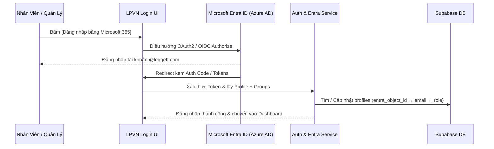

# Phase 11c — Microsoft Entra ID (Azure AD) Integration Specification

## 1. Mục tiêu & Bối cảnh Nghiệp vụ

Tích hợp xác thực Microsoft Entra ID (Azure AD) Single Sign-On (SSO) theo chuẩn OAuth2 / OpenID Connect (OIDC) cho **LPVN HR Flow SaaS**:
- Cho phép nhân sự Leggett & Platt Vietnam đăng nhập bằng tài khoản công ty Microsoft 365.
- Tự động đồng bộ vai trò phê duyệt từ Azure AD Security Groups sang hệ thống LPVN RBAC.
- Đảm bảo cơ chế Auth Fallback tự động hoạt động liên tục khi Azure AD mất kết nối.

---

## 2. Mô hình Ánh Xạ Quyền Hạn (Group Role Mapping)

| Azure AD Security Group | LPVN Flow Role | Quyền Hạn |
|:---|:---|:---|
| `LPVN_IT_Admins` / `LPVN_Global_Admins` | `ADMIN` | Toàn quyền cấu hình hệ thống, mẫu biểu và người dùng |
| `LPVN_HR_Managers` / `LPVN_HR_Specialists` | `HR_MANAGER` | Quản lý phép năm, công chuẩn, phê duyệt HR review |
| `LPVN_Department_Heads` / `LPVN_Supervisors` | `MANAGER` | Ký duyệt đơn nghỉ phép, giấy ra cổng của nhân viên cấp dưới |
| `LPVN_Security_Guards` | `SECURITY` | Trạm kiểm soát bảo vệ quét mã QR và cho phép ra/vào cổng |
| `LPVN_All_Employees` / Mặc định | `EMPLOYEE` | Tạo đơn, theo dõi lịch sử, xem bản in ISO |

---

## 3. Luồng Xác Thực SSO & Fallback

