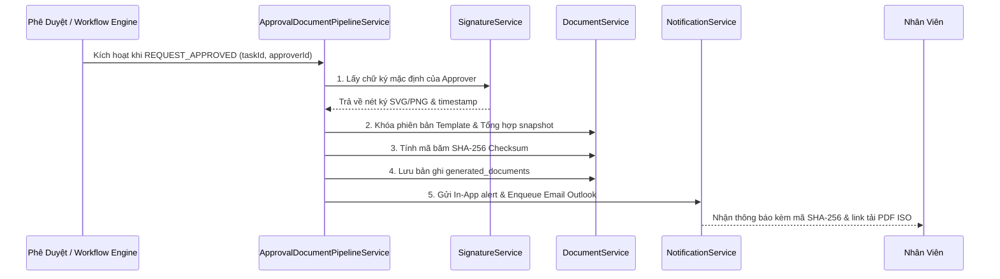

# Phase 11e — Approval → Document Pipeline Integration Specification

## 1. Mục tiêu & Bối cảnh Nghiệp vụ

Xây dựng luồng tự động hóa hoàn chỉnh kết nối từ thời điểm **Quản lý phê duyệt (Approval)** đến **Xuất bản văn bản chuẩn ISO có đóng dấu (Document Generation)** và **Thông báo cho Nhân viên (Multi-channel Dispatch)**:
- Tự động lấy nét ký (`Signature Resolution`) và gắn vào đúng vị trí trên biểu mẫu ISO.
- Khóa cố định phiên bản mẫu biểu (`Template Version Locking`) tại thời điểm duyệt.
- Tạo bản chụp dữ liệu bất biến và cấp mã băm bảo mật SHA-256 (`Anti-Tamper Cryptographic Checksum`).
- Tự động gửi thông báo In-App và Email Outlook kèm mã băm và link xem bản in cho nhân viên.

---

## 2. Các Bước Thực Thi Pipeline (5-Step Automated Workflow)

